# TwilioPizza API Setup Guide 🍕

Follow the steps below to set up and test the TwilioPizza API.

## Getting Started

### 1. **TwilioPizza Repository** 📁
   Clone and open the `twilioPizza` repository.

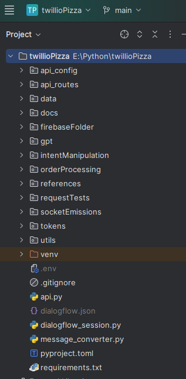

### 2. **Backend Configuration** 🐍
   Navigate to the Python backend and open `api.py`.

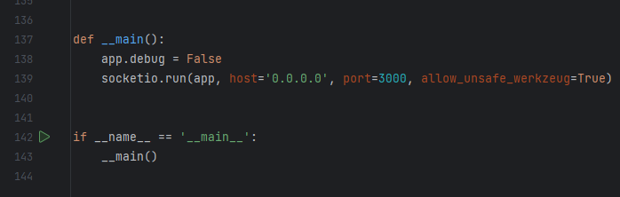

### 3. **Start the Server** 🌐
   Run the server on port `3000`.

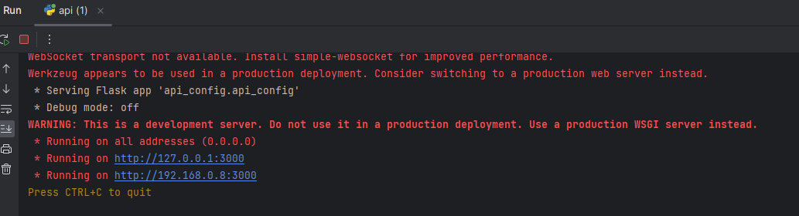

### 4. **Setup Ngrok** 🚀
   - Open `ngrok`.
   - Execute the following command:
     ```
     ngrok http 3000
     ```
   - Copy the new `ngrok` URL.

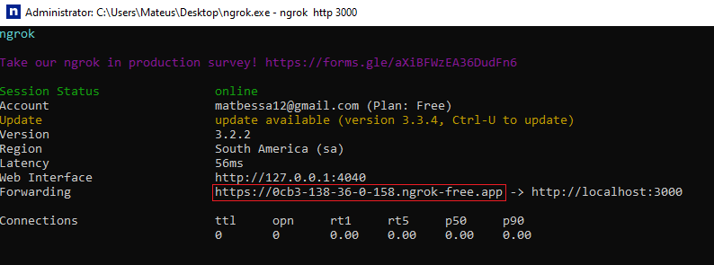

### 5. **Dialogflow Configuration** 🤖
   - Visit [Dialogflow Console](https://dialogflow.cloud.google.com).
   - Navigate to `fullfilment -> webhook`.
   - Paste the copied `ngrok` URL and save the changes.

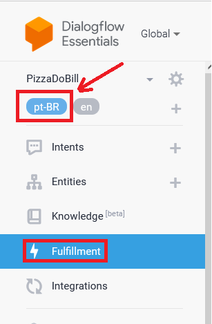
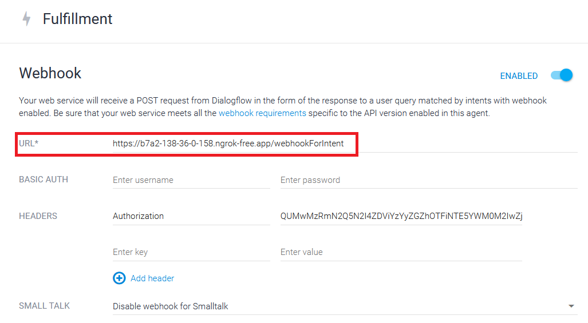

## Running the Tests

### 6. **OmnichatTests Repository** 📊
   Open the `omnichatTests` repository.

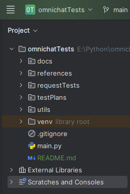

### 7. **Select Test Plan** 📝
   Under the `getCurrentPlan()` function, choose the `testPlan` you wish to run.

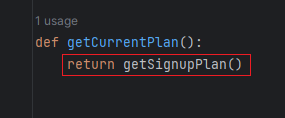

### 8. **Edit Test Plan (optional)** 📝
   As you can see, the `getSignupPlan()` function basically loads a .csv file with the test plan.
   You can edit it if you want.

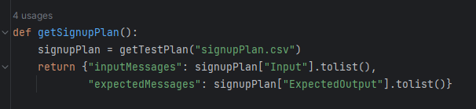
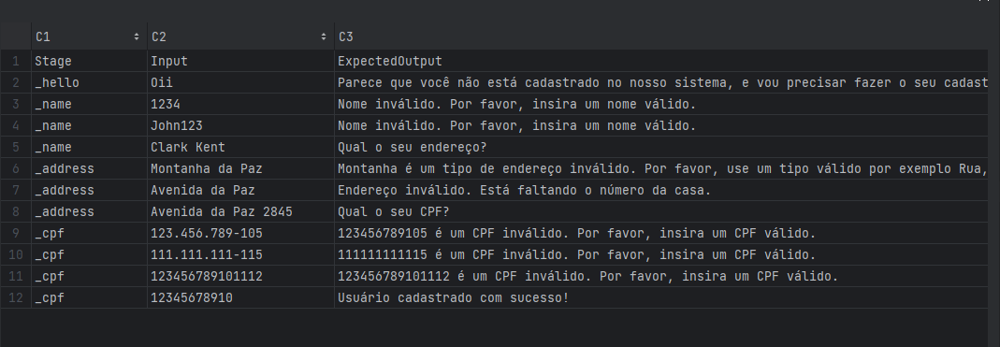

### 9. **Run the Test** 🚀
   Execute the test.
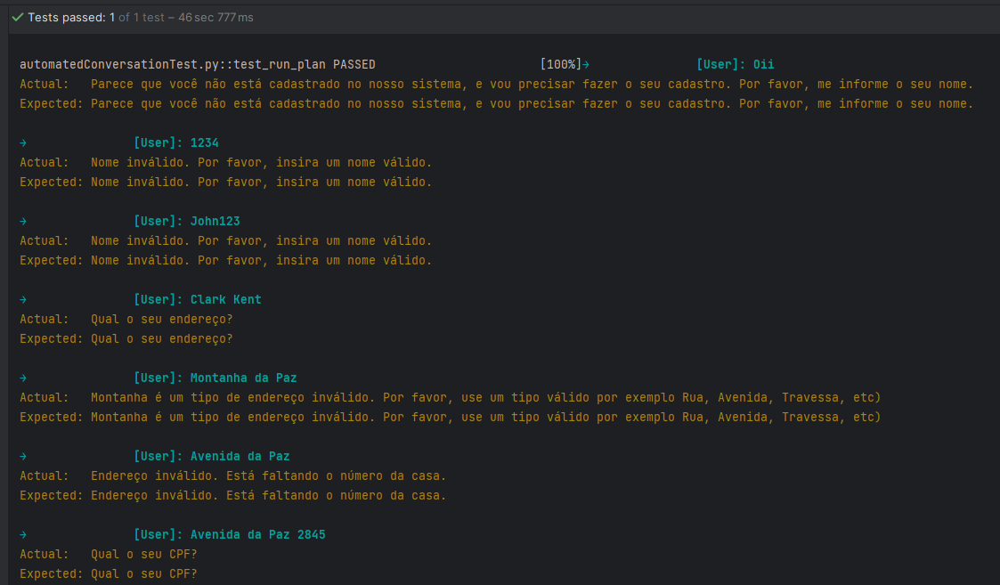

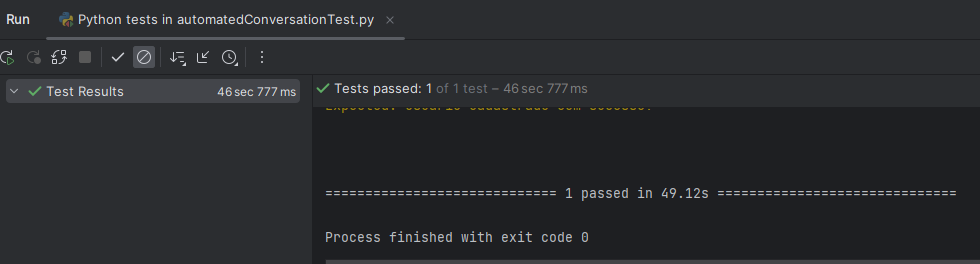
---

**Happy Coding!** 🎉
